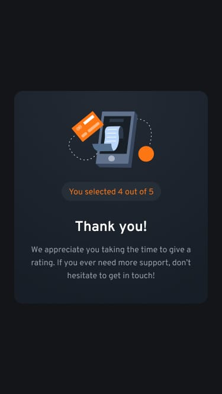

# 🌟 Frontend Mentor - Interactive Rating Component Solution

This is a solution to the [Interactive rating component challenge on Frontend Mentor](https://www.frontendmentor.io/challenges/interactive-rating-component-koxpeBUmI). Frontend Mentor challenges help you improve your coding skills by building realistic projects.

## 📋 Table of Contents

- [Overview](#overview)
  - [The Challenge](#the-challenge)
  - [Screenshot](#screenshot)
  - [Links](#links)
- [My Process](#my-process)
  - [Built With](#built-with)
  - [What I Learned](#what-i-learned)
  - [Continued Development](#continued-development)
  - [Useful Resources](#useful-resources)
- [Author](#author)
- [Acknowledgments](#acknowledgments)

## 🔎 Overview

### The Challenge

Users should be able to:

- View the optimal layout for the app depending on their device's screen size
- See hover states for all interactive elements on the page
- Select and submit a number rating
- See the "Thank you" card state after submitting a rating

### 📸 Screenshot

#### Desktop preview
.png)

#### Desktop active-states preview
.png)

#### Desktop thank-you-state preview
.png)

#### Mobile preview


#### Mobile thank-you-states preview


*Add your screenshot here. You can use Firefox to take a full-page screenshot or a tool like [FireShot](https://getfireshot.com/).*

### 🔗 Links

- Solution URL: [Solution - Interactive rating](https://www.frontendmentor.io/solutions/flexbox-vanilla-javascript-mobile-first-workflow-F85Gh22V5B)
- Live Site URL: [Interactive rating](https://interactive-rating-components-rose.vercel.app/)

## 🚀 My Process

### Built With

- Semantic HTML5 markup
- CSS custom properties
- Flexbox
- Vanilla JavaScript
- Mobile-first workflow

### 🧠 What I Learned

Use this section to recap over some of your major learnings while working through this project. Writing these out and providing code samples of areas you want to highlight is a great way to reinforce your own knowledge.

```html
<h1>Some HTML code I'm proud of</h1>
```
```css
.proud-of-this-css {
  color: papayawhip;
}
```
```js
const proudOfThisFunc = () => {
  console.log('🎉')
}
```

### 🔧 Continued Development

Use this section to outline areas that you want to continue focusing on in future projects. These could be concepts you're still not completely comfortable with or techniques you found useful that you want to refine and perfect.

### 📚 Useful Resources

- [Example resource 1](https://www.example.com) - This helped me for XYZ reason. I really liked this pattern and will use it going forward.
- [Example resource 2](https://www.example.com) - This is an amazing article which helped me finally understand XYZ. I'd recommend it to anyone still learning this concept.

## Author 👨‍💻

- Website - [Abdullah](https://social-links-profile-rose-mu.vercel.app/)
- LinkedIn - [LinkedIn](https://www.linkedin.com/in/abdullah-a-2940b7260/)
- Frontend Mentor - [Abdullah](https://www.frontendmentor.io/profile/Ayyubiy90)
- Twitter - [Abdullah](https://www.twitter.com/ayyubiy10)
- Instagram - [Abdullah](https://www.instagram.com/ayyubiy_10)

## Acknowledgments 🙏

A special thank you to Frontend Mentor for providing this challenge. I also appreciate the community for their inspiration and support!